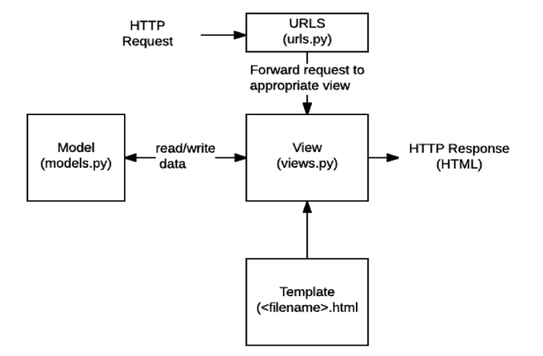

# Web Framework

## 개요

- World Wide Web
- 인터넷에 연결된 컴퓨터를 통해 정보를 공유할 수 있는 전 세계적인 정보 공간

## Static web page(정적 웹 페이지)

- 서버에 미리 저장된 파일이 사용자에게 그대로 전달되는 웹 페이지
- 서버가 정적 웹페이지에 대한 요청을 받은 경우 서버는 추가 처리 과정 없이 클라이언트에게 응답을 보냄
- 모든 상황에서 모든 사용자에게 동일한 정보를 표시
- 일반적으로 HTML, CSS, JavaScript로 작성
- flat page라고도 함

## Dynamic web page(동적 웹 페이지)

- 웹 페이지에 대한 요청을 받은 경우 서버는 추가적인 처리 과정 이후 클라이언트에게 응답을 보냄
- 동적 웹페이지는 방문자와 상호작용하기 때문에 페이지 내용은 그때그때 다름
- 서버 사이트 프로그래밍 언어(Python, Java, C++ 등)가 사용되며 파일을 처리하고 데이터베이스와 상호작용이 이루어짐

## Framework

- 프로그래밍에서 특정 운영 체제를 위한 응용 프로그램 표준 구조를 구현하는 클래스와 라이브러리 모임
- 재사용할 수 있는 수많은 코드를 프레임워크로 통합함으로써 표준 코드를 다시 작성하지 않아도 같이 사용할 수 있도록 도움
- Application framework

## Web Framework

- **웹 페이지를 개발하는 과정에서 겪는 어려움을 줄이는 것이 주 목적**
- 데이터베이스 연동, 템플릿 형태의 표준, 세션 관리, 코드 재사용 등의 기능 포함
- 동적인 웹 페이지나, 웹 애플리케이션, 웹 서비스 개발 보조용으로 만들어지는 Application Framework의 일종

## Framework Architecture

- MVC Design Pattern (model-view-controller)
- 소프트 웨어 공학에서 사용되는 디자인 패턴 중 하나
- 사용자 인터페이스로부터 프로그램 로직을 분리하여 애플리케이션의 시각적 요소나 이면에서 실행되는 부분을 서로 영향 없이 쉽게 고칠 수 있게 함
- Django는 MTV Pattern이라고 함

## MTV Pattern

### Model

- 응용프로그램의 데이터 구조를 정의하고 데이터베이스의 기록을 관리(추가, 수정, 삭제)

### Template

- 파일의 구조나 레이아웃을 정의
- 실제 내용을 정의하는 데 사용(presentation)

### View

- HTTP 요청을 수신하고 HTTP 응답을 반환
- Model을 통해 요청을 충족시키는데 필요한 데이터에 접근
- template에게 응답의 서식 설정을 맡김

