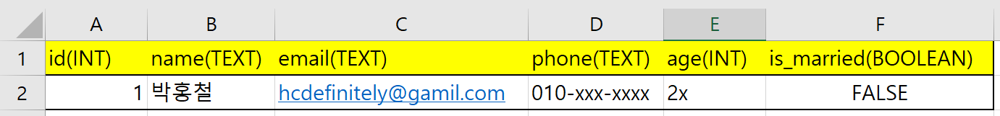

# Model

## 개요

- 데이터 베이스에 대한 내용

## 데이터베이스의 기본 구조

### 데이터베이스

- 체계화된 데이터의 모임

### 쿼리(Query)

- 데이터를 조회하기 위한 명령어
- 조건에 맞는 데이터를 추출하거나 조작하는 명령어
- "Query를 날린다" -> DB를 조작한다

### 스키마

- 데이터 베이스에서 자료의 구조, 표현방법, 관계 등을 정의한 구조

### 테이블

- 열: 필드 or 속성
- 행: 레코드 or 인스턴스

### PK(기본키)

- 각 행(레코드)의 고유값으로 Primary Key로 불림
- 반드시 설정 필요
- 데이터베이스 관리 및 관계 설정시 주요하게 활용


## ORM

- Object-Relational-Mapping
- **객체 지향 프로그래밍 언어**를 사용하여 호환되지 않는 유형의 시스템 간에(Django-SQL) **데이터를 변환하는 프로그래밍 기술**
- OOP 프로그래밍에서 RDBMS을 연동할 때, 데이터베이스와 객체 지향 프로그래밍 언어 간의 호환되지 않는 데이터를 변환하는 프로그래밍 기법
- Django는 내장 Django ORM을 사용


DB <-> SQL statement <-> ORM <-> Python Object




<->

```python
class Student:
    def __init__(self, *arg):
        self.id = arg[0]
        self.name = arg[1]
        self.email = arg[2]
        self.phone = arg[3]
        self.age = arg[4]
        self.is_married = arg[5]
```


### 장점

- SQL을 잘 알지 못해도 DB 조작 가능
- SQL의 절차적 접근이 아닌 객체 지향적 접근으로 인한 **높은 생산성**


### 단점

- ORM 만으로 완전한 서비스를 구현하기 어려울 수도 있음(가능성)


## Django Model

### models.py 작성

```django
class Article(models.Model):
	title = models.CharField(max_length=10)
	블라블라
```


## DB API

- DB를 조작하기 위한 도구
- Django가 기본적으로 ORM을 제공하여 DB를 편하게 조작할 수 있게 함
