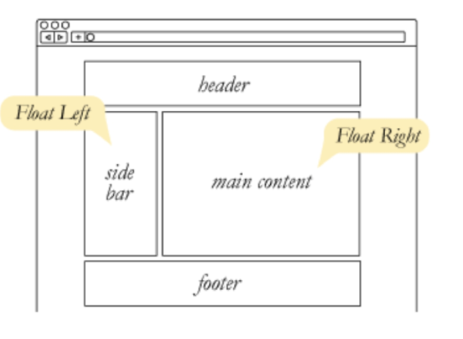
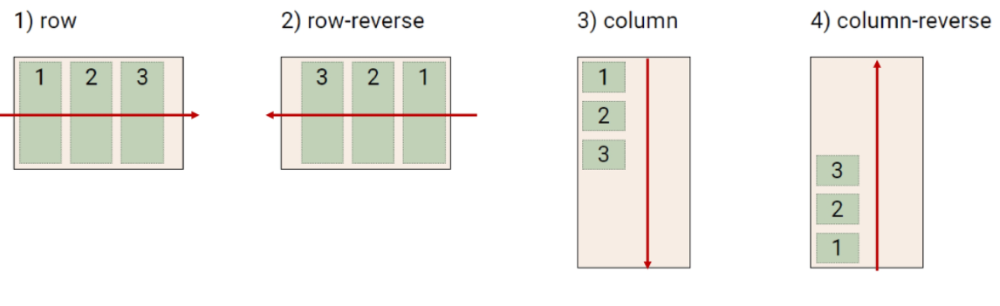
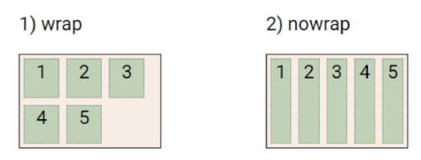
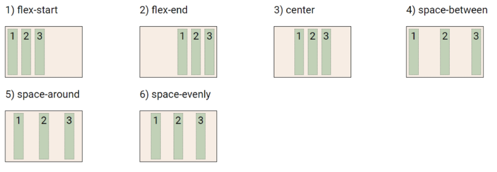
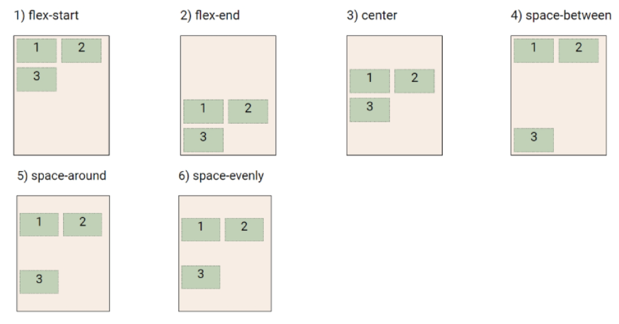
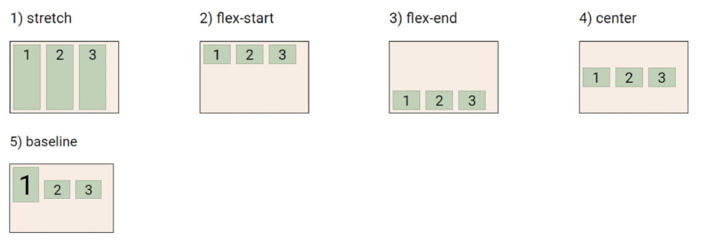
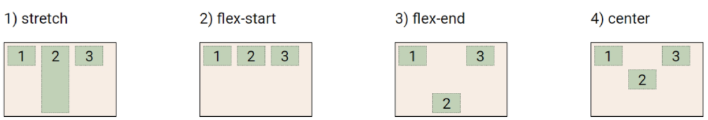

# CSS Layout

## Float

> https://developer.mozilla.org/ko/docs/Web/CSS/float

### 기본

- 박스를 왼쪽 혹은 오른쪽(`Float Left` or `Float Right`)으로 이동시킨 후 텍스트 포함 인라인 요소들이 주변을 wrapping 하도록 함
- 요소가 Normal flow를 벗어나도록 함

### 속성



- none: 기본값
- left: 요소를 왼쪽으로 띄움
- right: 요소를 오른쪽으로 띄움

### Clearing Float

- Float은 Normal Flow에서 벗어나 부동 상태(floating)
- 이후 요소에 대해 Float 속성이 적용되지 않도록 Clearing이 필수적임
  - `::after`: 선택한 요소의 맨 마지막 자식으로 가상 요소를 하나 생성
    - 보통 content 속성과 함께 짝지어, 요소에 장식용 콘텐츠를추가할 때 사용
  - clear 속성 부여


## Flexbox

### CSS Flexible Box Layout

- 행과 열 형태로 아이템들을 배치하는 **1차원** 레이아웃 모델(main axis 기준)
- 축
  - main axis
  - cross axis
- 구성 요소
  - Flex Container(부모 요소)
  - Flex Item(자식 요소)


### Flexbox 구성 요소

- Flex Container(부모 요소)

  - flexbox 레이아웃을 형성하는 가장 기본적인 모델
  - Flex Item들이 놓여있는 영역
  - display 속성을 flex 혹은 inline-flex로 지정

  

- Flex Item(자식 요소)

  - 컨테이너에 속해 있는 컨텐츠(박스)


### 효용

- 이전까지 Normal Flow를 벗어나는 수단은 Float 혹은 Position
- Flexible 도입 후 수동 값 부여 없이 수직 정렬 가능
- 아이템의 너비와 높이 혹은 간격을 동일하게 배치 가능


### Flex 속성

```html
.flex-container {
	display: flex;
<--! 혹은 line: flex-->
}
```

#### flex-direction



- Main axis 기준 방향 설정
- 역방향의 경우 HTML 태그 선언 순서와 시각적으로 반대이니 유의(웹 접근성에 영향)

| 코드             | 기능                                 |
| ---------------- | ------------------------------------ |
| `row`            | 요소들을 텍스트 방향과 동일하게 정렬 |
| `row-reverse`    | 요소들을 텍스트 방향과 반대로 정렬   |
| `column`         | 요소들을 위에서 아래로 정렬          |
| `column-reverse` | 요소들을 아래서 위로 정렬            |


#### flex-wrap



- 아이템이 컨테이너를 벗어나는 경우 해당 영역 내에 배치되도록 설정
- 즉, 아이템이 컨테이너 영역을 벗어나지 않도록 함

| 코드              | 기능                              |
| ----------------- | --------------------------------- |
| `nowrap`(기본 값) | 한 줄에 배치                      |
| `wrap`            | 넘치면 그 다음 줄로 배치          |
| `wrap-reverse`    | 역순이고 넘치면 그 다음 줄로 배치 |


### flex-flow

- flex-direction과 flex-wrap의 shorthand
- flex-direction과 flex-wrap에 대한 설정 값을 차례로 작성


### justify-content



- Min axis를 기준으로 공간 배분
- 행 기준


### align-content



- Cross axis를 기준으로 공간 배분(아이템이 한 줄로 배치될 경우 확인할 수 없음)
- 열 기준


### justify-content & align-content

| 코드                  | 기능                                                         |
| --------------------- | ------------------------------------------------------------ |
| `flex-start` (기본값) | 아이템들을 axis 시작점으로                                   |
| `flex-end`            | 아이템들을 axis 끝 쪽으로                                    |
| `center`              | 아이템들을 axis 중앙으로                                     |
| `space-between`       | 아이템 사이 간격을 균일하게 분배                             |
| `space-around`        | 아이템 둘러싼 영역을 균일하게 분배<br />가질 수 있는 영역을 반으로 나눠 양쪽에 |
| `space-evenly`        | 전체 영역에서 아이템 간 간격을 균일하게 분배                 |
| `stretch`             | 여러 줄들을 컨테이너에 맞도록 늘림                           |


### align-items



- 모든 아이템을 Cross axis 기준으로 정렬


### align-self



- 개별 아이템을 Cross axis 기준으로 정렬
- **주의! 해당 속성은 콘테이너가 아니라 개별 아이템에 적용**


### align-items & algin-self

- Cross axis 기준!

| 코드               | 기능                            |
| ------------------ | ------------------------------- |
| `strech` (기본 값) | 컨테이너를 가득 채움            |
| `flex-start`       | 위                              |
| `flex-end`         | 아래                            |
| `center`           | 가운데                          |
| `baseline`         | 텍스트 baseline에 기준선을 맞춤 |


### 기타 속성

- `flex-grow`: 남은 영역을 아이템에 분배
- `order`: 배치 순서
