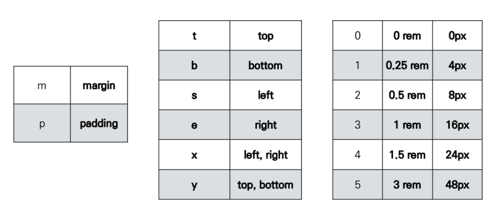

# Bootstrap

## CDN

> Content Delivery(Distribution) Network

- 컨텐츠(CSS, JS, Image, Text 등)을 효율적으로 전달하기 위해 여러 노드에 가진 네트워크에 데이터를 제공하는 시스템
- 개별 end-user의 가까운 서버를 통해 빠르게 전달 가능
- 외부 서버를 활용함으로써 본인의 서버의 부하가 적어짐

## spacing

### .m-1

- margin-top 0.25rem == 4px (root 글꼴 크기는 16px)

### .mx-0

- margin-right, margin-left 0

### .mx-auto

- margin-right, margin-left auto
- 수평 중앙 정렬

### .py-0

- padding-top, padding-bottom 0

### 조합표

## color

## Responsive Web Design

- 반응형 웹
- 별도의 기술 이름이 아닌 웹 디자인에 대한 접근 방식, 반응형 레이아웃 작성에 도움이 되는 사례들의 모음 등을 기술하는 데 사용되는 용어

## Grid System(web design)

- 요소들의 디자인과 배치에 도움을 주는 시스템
- 기본 요소
  - Column: 실제 컨텐츠를 포함하는 부분
  - Gutter: 칼럼과 칼럼 사이의 공간 (사이 가격)
  - Container: Column들을 담고 있는 공간
- flexbox로 제작됨
- container, rows, column으로 컨텐츠를 배치하고 정렬
- 12개의 column, 6개의 grid breakpoints